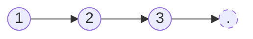
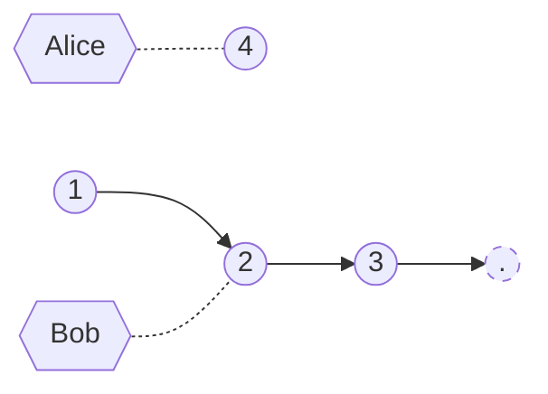
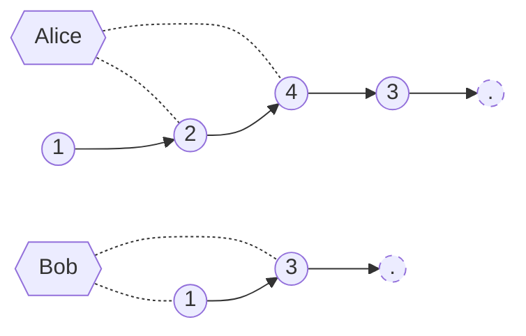
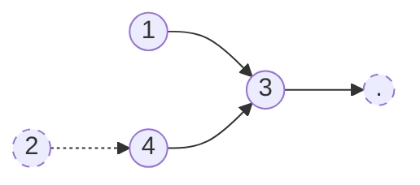

# How to run
1. [Install Rust.](https://www.rust-lang.org/tools/install)
2. Run `cargo run` from the root of the repo.

# Problem 1
The problem likely occured as a result of presents somehow becoming lost between when they were removed from the bag*, and when they were removed from the list to have a card written for their givers.

\* at which point they are added to the running tally via "which the servants realized at the end of the day that they had more presents than “Thank you” notes".

## An example of how an inconsistent state was reached

Consider this initial state of the list, consisting of three nodes.

Thread Alice wants to add a new node `4` between nodes `2` and `3`.
Thread Bob wants to delete node `2`.

Bob deletes `2`, linking `1` to `3` in the process.
Simutaneously, Alice adds `4` (at which point it is considered accounted for, having been removed from the "bag of presents"), and links `2` to `4` and `4` to `3`. Now, there are two diverging versions of the state of the list.

The net result is this inconsistent state, where `4` is left dangling from `3` and is essentially unreachable. As a result, when the nodes are popped off from the list to have "thank you notes written", `4`'s note will never be written; this is situation is an example of how the Minotaur ended up with more presents added to the list than were removed.

## Proposed solution

We can allow for fine-grained concurrency as long as we don't violate the [Pointer Safety Principle](https://rust-book.cs.brown.edu/ch04-02-references-and-borrowing.html?highlight=Pointer%20Safety%20Principle#rust-avoids-simultaneous-aliasing-and-mutation:~:text=Pointer%20Safety%20Principle%3A%20data%20should%20never%20be%20aliased%20and%20mutated%20at%20the%20same%20time.):

> "Data should never be aliased and mutated at the same time."

The only data dependencies that a given node in a singularly-linked list has is its immediate neighbors; concurrent operations on a list are safe so long as the operations take place on nodes that have at least two nodes in between them.

As long as we can prevent threads from concurrently accessing and/or mutating adjacent nodes, we can allow arbitrary concurrent operations on the list. In the event that two threads do attempt to operate on nearby nodes, one will defer to the other, and simply try again (so this solution also involves optimistic synchronization). However, for sufficiently large lists, the chances of a "collision" between threads becomes increasingly negligible.

Each individual node has its own lock. Threads traverse through the list without having to obtain these locks. When a thread finds the present it wishes to perform an operation (add or remove) on, it attempts to obtain the lock on the node in question, as well as the locks of adjacent nodes (next for both add and remove, and remove also needs previous).

<!-- ## Code analogy

| Concept in problem | Code analogy | 
|-|-|
| Bag of *n* presents | Shuffled linked list of *n* elements |
| -->

# Problem 2

Strictly speaking, the individual sensors are responsible only "for collecting temperature readings at regular intervals and storing them in shared memory space." We accomplish this by having a main thread responsible for signalling to the eight sensor threads to collect data, and then processing the collected data by reading it in from shared memory.

Here, the memory is shared via a mutex for each of the sensor threads. The main thread ensures that each of the sensor threads have concluded their work checking a single shared counter between all the sensor threads, which each sensor thread increments upon completing its work and releasing its mutex.

The requirement for all worker threads to have signalled the completion of their work guarantees that the main thread and the worker threads never overlap their locks over the mutex. Conversely, it also guarantees that the worker threads will never be blocked as they acquire the lock, satisfying the requirement that we do not "delay a sensor and miss the interval of time when it is supposed to conduct temperature reading."

<!-- | Concept in problem | Code analogy |
|  -->